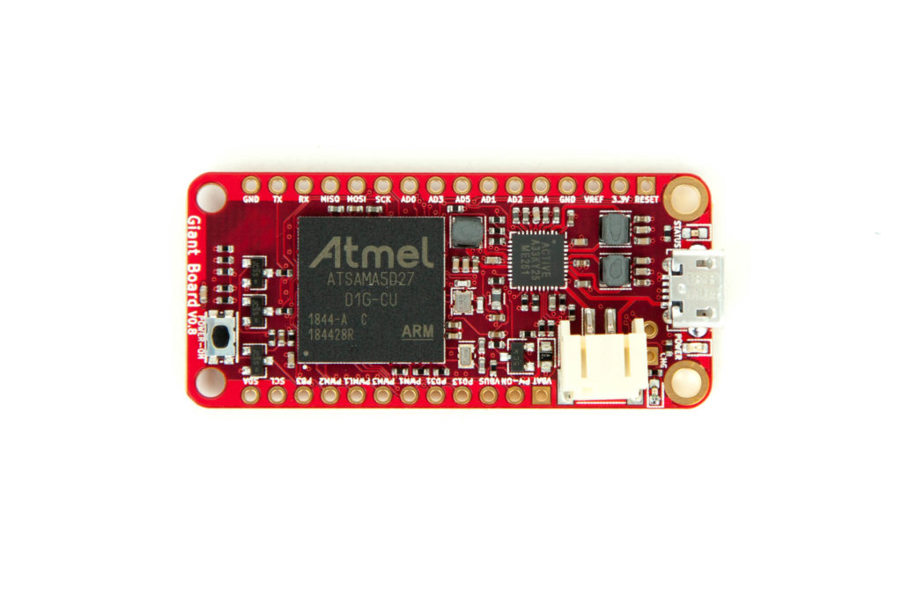

# Giant Board

 [Image credit](#groboards)

| Feature              | Description                     |
| -------------------- | ------------------------------- |
| CPU                  | 500 MHz quad-core ARM Cortex-A5 |
| Memory               | 128M DDR2                       |
| Storage              | MicroSD                         |
| GPIO, I2C, SPI       | Yes - [Elixir Circuits](https://github.com/elixir-circuits) |
| UART                 | ttyS0                           |
| Ethernet             | No                              |
| Video                | No                              |
| Camera Interface     | No                              |
